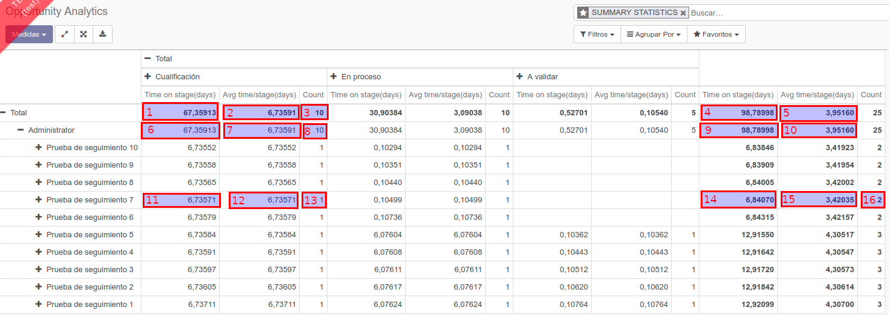
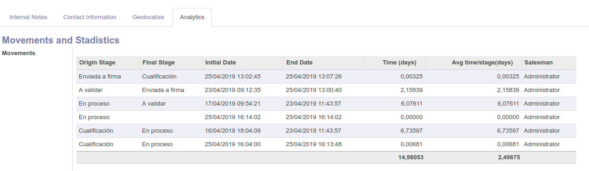

.. image:: https://img.shields.io/badge/license-AGPL--3-blue.png
   :target: https://www.gnu.org/licenses/agpl
   :alt: License: AGPL-3

CRM Analytics
=============

Module for monitoring stage change in an opportunity, with data analysis.
It is recorded, when the status of the stage of an opportunity has been changed, registering: date, opportunity, beginning stage and final stage, this new record is called "move".

At the same time, there is an access menu and the list, pivot and graph views.

(es_ES)
Módulo para el seguimiento de cambio de etapa en una oportunidad, con análisis de datos.
Se registra, cuándo se ha cambiado el estado de la etapa de una oportunidad, registrando: fecha, oportunidad, etapa de inicio y etapa final, a este nuevo registro se le llama "move".

A su vez se realizan las siguientes mediciones:

* Tiempo que pasa una oportunidad en una etapa (desde que se mueve a esa etapa hasta que se mueve a la siguiente, u otra).
* Número de veces que ha estado una oportunidad en una misma etapa.
* Tiempo medio que pasa una oportunidad concreta en una etapa concreta.
* Tiempo medio que pasa una oportunidad concreta por todas las etapas (en conjunto).
* Tiempo medio que pasa una oportunidad en una etapa concreta (en conjunto).
* Vida de una oportunidad, desde que se crea hasta el momento actual.
* Vida de una oportunidad, desde que se crea hasta el momento en que se gana (añadiendo filtro "quitar etapa ganada").

A su vez, se dispone de un Menú de acesso y las vistas lista, pivot.

Configuration
=============
Install Module.

Usage
=====
A menu has been enabled in CRM / Reports / Opportunity Analytics.

With the tree view you can see all the "movements" that have been made. Each movement represents the change, of an opportunity, from one stage to another.

In the pivot view, it has a filter, SUMMARY STATISTICS, where the data already shown are shown.

1. **TOTAL time that the opportunities pass in the "Qualification" stage.**
1. **Average time an opportunity passes in the "Qualification" stage.**
1. Number of opportunities that have passed through the "Qualification" stage.
1. Total life time of all opportunities.
1. **Total average time of all opportunities.**
1. **TOTAL time that an opportunity passes in the "Qualification" stage, of the commercial "Administrator".**
1. **Average time an opportunity passes in the "Qualification" stage, of the commercial "Administrator".**
1. Number of times an opportunity has been in the "Qualification" stage of the "Administrator" commercial.
1. Total time of all opportunities, from the commercial "Administrator".
1. **Average time an opportunity passes, since it is created up to the current moment, from the commercial "Administrator".**
    1. **Since it is created until the moment it is won (by adding "Remove stage won" filter)**
1. **Time that a concrete opportunity passes in the "Qualification" stage.**
1. Average time that a concrete opportunity passes in the "Qualification" stage.
1. Number of times an opportunity has been in the "Qualification" stage.
1. **Life of an opportunity, since it is created up to the current moment.**
    1. **Since it is created until the moment it is won (by adding "Remove stage won" filter)**
1. **Average time an opportunity passes in a specific stage (as a whole).**
    1. **Average time an opportunity passes until the moment it is won (adding "Remove stage won" filter)**
1. Number of times that a specific opportunity has been moved, since it is created up to the current moment.

In addition, a new tab, "Analytics", is added in the opportunity view, with the total average of the opportunity and the list of movements made.

(es_ES)
Se ha habilitado un menú en CRM / Informes / Opportunity Analytics.

Con la vista de árbol puedes ver todos los "movimientos" que se han realizado. Cada movimiento representa el cambio, de una oportunidad, de una etapa a otra.

En la vista dinámica, tiene un filtro, ESTADÍSTICAS RESUMIDAS, donde se muestran los datos que ya se muestran.

1. **Tiempo TOTAL que pasan las oportunidades en la etapa "Cualifiación".**
1. **Tiempo medio que pasa una oportunidad en la etapa "Cualifiación".**
1. Número de oportunidades que han pasado por la etapa "Cualifiación".
1. Tiempo de vida total de todas las oportunidades.
1. **Tiempo medio total de todas las oportunidades.**
1. **Tiempo TOTAL que pasa una oportunidad en la etapa "Cualifiación", del comercial "Administrador".**
1. **Tiempo medio que pasa una oportunidad en la etapa "Cualifiación", del comercial "Administrador".**
1. Número de veces que ha estado una oportunidad en la etapa "Cualifiación", del comercial "Administrador".
1. Tiempo total de todas las oportunidades, del comercial "Administrador".
1. **Tiempo medio que pasa una oportunidad, desde que se crea hasta el momento actual, del comercial "Administrador".**
    1. **Desde que se crea hasta el momento en que se gana (añadiendo filtro "Remove stage won").**
1. **Tiempo que pasa una oportunidad concreta en la etapa "Cualifiación".**
1. Tiempo medio que pasa una oportunidad concreta en la etapa "Cualifiación".
1. Número de veces que ha estado una oportunidad en la etapa "Cualifiación".
1. **Vida de una oportunidad, desde que se crea hasta el momento actual.**
    1. **Desde que se crea hasta el momento en que se gana (añadiendo filtro "Remove stage won").**
1. **Tiempo medio que pasa una oportunidad en una etapa concreta (en conjunto).**
    1. **Tiempo medio que pasa una oportunidad hasta el momento en que se gana (añadiendo filtro "Remove stage won")**
1. Número de veces que se ha movido una oportunidad concreta, en desde que se crea hasta el momento actual.

Además, se agrega una nueva pestaña, "Análisis", en la vista de oportunidad, con el promedio total de la oportunidad y la lista de movimientos realizados.

Bug Tracker
===========

In case of trouble, please contact to our Odoo support team at `SDi <https://www.sdi.es/empresa/contacto/>`_

Credits
=======

Contributors
------------

* `SDI <http://www.sdi.es>`_
  * Óscar Soto <osoto@sdi.es>

Do not contact contributors directly about support or help with technical issues.
